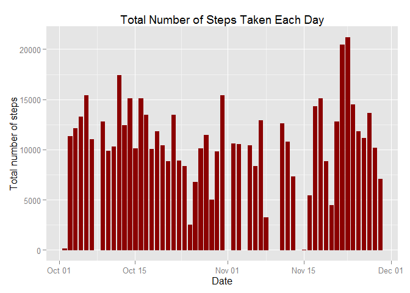
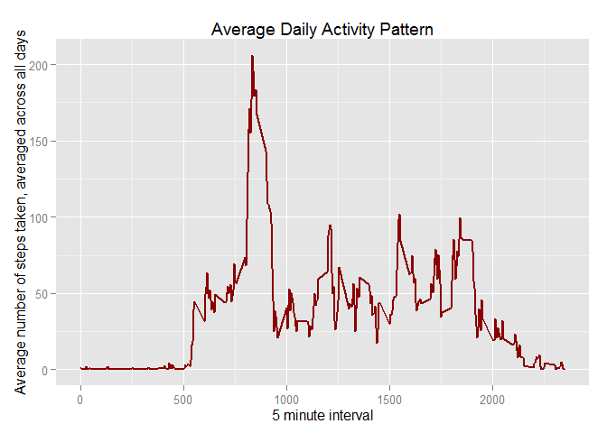
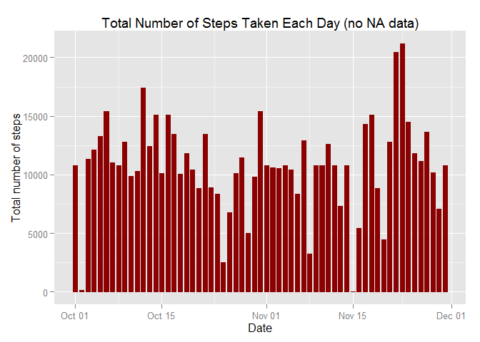

# Reproducible Research: Peer Assessment 1

## Loading & preprocessing the data

```r
activity<-read.csv("activity.csv",colClasses = c("integer", "Date", "factor"))
noNA.activity<-na.omit(activity)
```

## What is mean total number of steps taken per day?

1) Make a Histogram of total number of steps take each day

```r
library(ggplot2)
Q2plot<-ggplot(noNA.activity, aes(date, steps))+ geom_bar(stat = "identity", colour = "darkred", fill = "darkred", width = 0.7)+ labs(title = "Total Number of Steps Taken Each Day", x = "Date", y = "Total number of steps")
print(Q2plot)
```

 

2) Calculate Mean & Median of total steps taken each day

Aggregate the total steps

```r
Total.steps <- tapply(noNA.activity$steps, noNA.activity$date, FUN = sum)
```

Calculate Mean

```r
mean(Total.steps)
```

```
## [1] 10766.19
```

Calculate Median

```r
median(Total.steps)
```

```
## [1] 10765
```

## What is the average daily pattern?

1)
Calculate average steps taken

```r
avgActivitySteps <- aggregate(noNA.activity$steps, list(interval = as.numeric(as.character(noNA.activity$interval))), FUN = "mean")
names(avgActivitySteps)[2] <- "StepsAvg"
```

Make time series plot

```r
library(ggplot2)
Q3plot<-ggplot(avgActivitySteps, aes(interval, StepsAvg)) + geom_line(color = "darkred", size = 0.8) + labs(title = "Average Daily Activity Pattern", x = "5 minute interval", y = "Average number of steps taken, averaged across all days")
plot(Q3plot)
```

 

2) Calculate which 5-minute interval, on average across all the days in the dataset, contains the maximum number of steps?

```r
avgActivitySteps[avgActivitySteps$StepsAvg == max(avgActivitySteps$StepsAvg),]
```

```
##     interval StepsAvg
## 104      835 206.1698
```

## Inputing missing values

1) Calculate and report the total number of missing values in the dataset 

```r
sum(!complete.cases(activity))
```

```
## [1] 2304
```

2) Fill in the missing values - the strategy here is to input the mean of the 5 minute interval into the steps column which has NA rows 
3) Create new dataset using strategy above & check that there is no missing value


```r
new.activity <- activity 
for (i in 1:nrow(new.activity)) {
  if (is.na(new.activity$steps[i])) {
    new.activity$steps[i] <- avgActivitySteps[which(new.activity$interval[i] == avgActivitySteps$interval), ]$StepsAvg
  }
}
```


```r
sum(!complete.cases(new.activity))
```

```
## [1] 0
```

4)
Make Histogram of the new dataset

```r
library(ggplot2)
Q4plot<-ggplot(new.activity, aes(date, steps)) + geom_bar(stat = "identity",colour = "darkred",fill = "darkred",width = 0.7) + labs(title = "Total Number of Steps Taken Each Day (no NA data)", x = "Date", y = "Total number of steps")
print(Q4plot)
```

 

Calculate the new dataset Mean & Median of total steps taken each day


```r
newTotal.steps <- tapply(new.activity$steps, new.activity$date, FUN = sum)
```

Calculate new Mean

```r
new.mean<-mean(newTotal.steps)
new.mean
```

```
## [1] 10766.19
```
Calculate new Median

```r
new.median<-median(newTotal.steps)
new.median
```

```
## [1] 10766.19
```

To compare the old dataset with new dataset


```r
old.mean<-mean(Total.steps)
old.median<-median(Total.steps)
```

Compare the means

```r
diffmean<- new.mean - old.mean
diffmean
```

```
## [1] 0
```

Compare the medians

```r
diffmedian<-new.median - old.median 
diffmedian
```

```
## [1] 1.188679
```

Findings:

1) the means for both old and new dataset are the same because the NA is replaced with mean value

2) the median for new data are different compared to old data because the position and number of the replacement  of NA values will affect the              new median. For this case, the new median is slightly higher compared to old dataset.

## Are there any differences in activity patterns between weekdays and weekends?

1) Create new variable "weekend" or "weekdays" in the new dataset

```r
new.activity$weekdays=factor(weekdays(new.activity$date))
levels(new.activity$weekdays)
```

```
## [1] "Friday"    "Monday"    "Saturday"  "Sunday"    "Thursday"  "Tuesday"  
## [7] "Wednesday"
```

Transform from day to weekend or weekdays

```r
levels(new.activity$weekdays) <- list(Weekday = c("Monday", "Tuesday","Wednesday", "Thursday", "Friday"),Weekend = c("Saturday", "Sunday"))
levels(new.activity$weekdays)
```

```
## [1] "Weekday" "Weekend"
```

2) Make a panel plot for the time series using new variable


```r
new.avgActivitySteps <- aggregate(new.activity$steps, list(interval = as.numeric(as.character(new.activity$interval)), weekdays = new.activity$weekdays), FUN = "mean")
names(new.avgActivitySteps)[3] <- "newStepsAvg"
```


```r
library(lattice)
Q5plot<-xyplot(new.avgActivitySteps$newStepsAvg ~ new.avgActivitySteps$interval | new.avgActivitySteps$weekdays, layout = c(1, 2), type = "l", xlab = "Interval", ylab = "Number of steps")
print(Q5plot)
```

 
